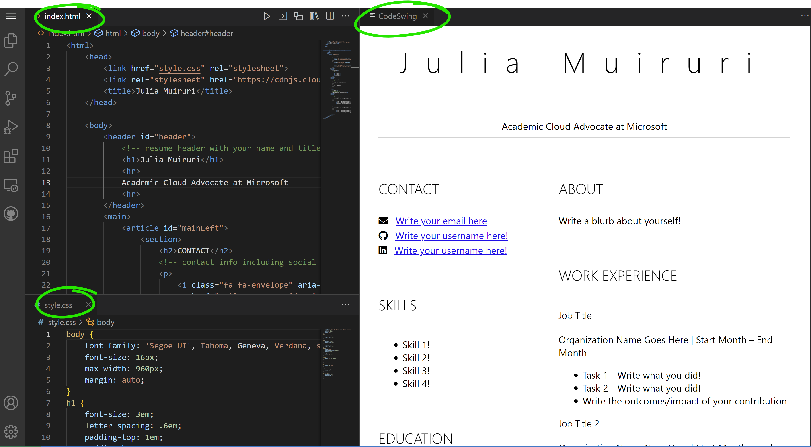

# Crear un sitio web de currículum usando vscode.dev

_¿Qué tan genial sería que un reclutador te pida tu currículum y le envíes una URL?_ 😎

<!----
TODO: add an optional image

> Sketchnote by [Author name](https://example.com)
---->

<!---
## Pre-Lecture Quiz
[Pre-lecture quiz](https://ashy-river-0debb7803.1.azurestaticapps.net/quiz/3)
---->

## Objetivos

Después de esta tarea, aprenderás a:

- Crear un sitio web para mostrar tu currículum

### Prerequisitos

1. Una cuenta de GitHub. Ve a [GitHub](https://github.com/) y crea una cuenta si aún no lo has hecho.

## Pasos

**Paso 1:** Crea un nuevo repositorio de GitHub y asígnale el nombre `my-resume`


**Paso 2** Crea un archivo `index.html` en tu repositorio. Agregaremos al menos un archivo mientras aún estés en github.com porque no puedes abrir un repositorio vacío en vscode.dev

Haz clic en el enlace `crear un nuevo archivo`, escribe el nombre `index.html` y selecciona el botón `Commit new file`


**Paso 3:** Abre [VSCode.dev](https://vscode.dev) y selecciona el botón `Open Remote Repository`

Copia la URL en el repositorio que acabas de crear para tu sitio de currículum y pégalo en el cuadro de entrada:

_Reemplaza `your-username` con tu nombre de usuario de GitHub_

```
https://github.com/your-username/my-resume
```

✅ Si tienes éxito, verás que tu proyecto y el archivo index.html se abren en el editor de texto del navegador.


**Paso 4:** Abre el archivo `index.html`, pega el código a continuación en tu área de código y guarda los cambios.

<details>
    <summary><b>HTML code responsible for the content on your resume website.</b></summary>
    
        <html>

            <head>
                <link href="style.css" rel="stylesheet">
                <link rel="stylesheet" href="https://cdnjs.cloudflare.com/ajax/libs/font-awesome/5.15.4/css/all.min.css">
                <title>Your Name Goes Here!</title>
            </head>
            <body>
                <header id="header">
                    <!-- resume header with your name and title -->
                    <h1>Your Name Goes Here!</h1>
                    <hr>
                    Your Role!
                    <hr>
                </header>
                <main>
                    <article id="mainLeft">
                        <section>
                            <h2>CONTACT</h2>
                            <!-- contact info including social media -->
                            <p>
                                <i class="fa fa-envelope" aria-hidden="true"></i>
                                <a href="mailto:username@domain.top-level domain">Write your email here</a>
                            </p>
                            <p>
                                <i class="fab fa-github" aria-hidden="true"></i>
                                <a href="github.com/yourGitHubUsername">Write your username here!</a>
                            </p>
                            <p>
                                <i class="fab fa-linkedin" aria-hidden="true"></i>
                                <a href="linkedin.com/yourLinkedInUsername">Write your username here!</a>
                            </p>
                        </section>
                        <section>
                            <h2>SKILLS</h2>
                            <!-- your skills -->
                            <ul>
                                <li>Skill 1!</li>
                                <li>Skill 2!</li>
                                <li>Skill 3!</li>
                                <li>Skill 4!</li>
                            </ul>
                        </section>
                        <section>
                            <h2>EDUCATION</h2>
                            <!-- your education -->
                            <h3>Write your course here!</h3>
                            <p>
                                Write your institution here!
                            </p>
                            <p>
                                Start - End Date
                            </p>
                        </section>            
                    </article>
                    <article id="mainRight">
                        <section>
                            <h2>ABOUT</h2>
                            <!-- about you -->
                            <p>Write a blurb about yourself!</p>
                        </section>
                        <section>
                            <h2>WORK EXPERIENCE</h2>
                            <!-- your work experience -->
                            <h3>Job Title</h3>
                            <p>
                                Organization Name Goes Here | Start Month – End Month
                            </p>
                            <ul>
                                    <li>Task 1 - Write what you did!</li>
                                    <li>Task 2 - Write what you did!</li>
                                    <li>Write the outcomes/impact of your contribution</li>
                                    
                            </ul>
                            <h3>Job Title 2</h3>
                            <p>
                                Organization Name Goes Here | Start Month – End Month
                            </p>
                            <ul>
                                    <li>Task 1 - Write what you did!</li>
                                    <li>Task 2 - Write what you did!</li>
                                    <li>Write the outcomes/impact of your contribution</li>
                                    
                            </ul>
                        </section>
                    </article>
                </main>
            </body>
        </html>
</details>

Agrega los detalles de tu currículum para reemplazar el _texto del marcador_ en el código HTML

**Paso 5:** Coloca el cursor sobre la carpeta My-Resume, haz clic en el icono `New File ...` y crea 2 archivos nuevos en tu proyecto: los archivos `style.css` y `codeswing.json` 

**Paso 6:** Abre el archivo `style.css`, pega el código de abajo y guarda

 <details>
        <summary><b>CSS code to format the layout of the site.</b></summary>
            
            body {
                font-family: 'Segoe UI', Tahoma, Geneva, Verdana, sans-serif;
                font-size: 16px;
                max-width: 960px;
                margin: auto;
            }
            h1 {
                font-size: 3em;
                letter-spacing: .6em;
                padding-top: 1em;
                padding-bottom: 1em;
            }

            h2 {
                font-size: 1.5em;
                padding-bottom: 1em;
            }

            h3 {
                font-size: 1em;
                padding-bottom: 1em;
            }
            main { 
                display: grid;
                grid-template-columns: 40% 60%;
                margin-top: 3em;
            }
            header {
                text-align: center;
                margin: auto 2em;
            }

            section {
                margin: auto 1em 4em 2em;
            }

            i {
                margin-right: .5em;
            }

            p {
                margin: .2em auto
            }

            hr {
                border: none;
                background-color: lightgray;
                height: 1px;
            }

            h1, h2, h3 {
                font-weight: 100;
                margin-bottom: 0;
            }
            #mainLeft {
                border-right: 1px solid lightgray;
            }
            
</details>

**Paso 6:** Abre el archivo `codeswing.json`, pega el código de abajo y guarda

    {
    "scripts": [],
    "styles": []
    }


**Paso 7:** Instala la `extensión Codeswing` para visualizar el sitio web del currículum en el área del código. 

Haz clic en el icono _`Extensiones`_ en la barra de actividades y escribe Codeswing. Haz clic en el _botón de instalación azul_ en la barra de actividad expandida para instalar o usa el botón de instalación que aparece en el área del código una vez que selecciones la extensión para cargar información adicional. Inmediatamente después de instalar la extensión, observa tu área de código para ver los cambios en tu proyecto 😃


Esto es lo que verás en su pantalla después de instalar la extensión.



Si estás satisfecho con los cambios que realizaste, coloca el cursor sobre la carpeta "Cambios" y haz clic en el botón "+" para realizar los cambios.

Escribe un mensaje de confirmación _(Una descripción del cambio que has realizado en el proyecto)_ y confirma tus cambios haciendo clic en el `check`. Una vez que hayas terminado de trabajar en tu proyecto, selecciona el ícono del menú de hamburguesa en la parte superior izquierda para regresar al repositorio en GitHub.

Felicidades 🎉 Acabas de crear tu sitio web de currículum utilizando vscode.dev en unos pocos pasos.
## 🚀 Desafío

Abre un repositorio remoto en el que tenga permisos para realizar cambios y actualiza algunos archivos. A continuación, intenta crear una nueva rama con tus cambios y realiza un Pull Request.

<!----
## Post-Lecture Quiz
[Post-lecture quiz](https://ashy-river-0debb7803.1.azurestaticapps.net/quiz/4)
---->

## Revisión y Autoestudio

Leer más sobre [VSCode.dev](https://code.visualstudio.com/docs/editor/vscode-web?WT.mc_id=academic-0000-alfredodeza) y algunas de sus otras características.
